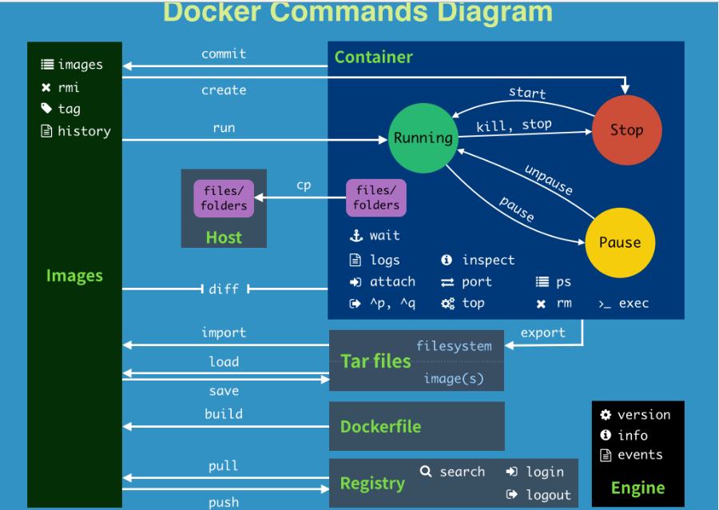

# 启动相关命令

```bash
systemctl start docker
		  stop
		  restart
		  
		  # 查看状态
		  status

# Docker信息
docker version
docker info
docker [OPTIONS] COMMAND
docker [命令] --help
```


# 镜像命令

```bash
#################### 查看本地镜像 ####################
docker images [OPTIONS] [REPOSITORY[:TAG]]

## 选项
-a, --all             Show all images (default hides intermediate images)
-q, --quiet           Only show image IDs

#################### 查看镜像、容器、数据卷所占用的空间 ####################
docker system df

#################### 搜索 ####################
docker search [OPTIONS] TERM

## 例子
docker search centos

#################### 拉取镜像 ####################
docker pull [OPTIONS] NAME[:TAG|@DIGEST]

## 例子
docker pull centos

#################### 删除镜像 ####################
docker rmi [OPTIONS] IMAGE [IMAGE...]

## 选项
-f 强制删除

## 例子
docker rmi -f centos

#################### 提交推送镜像 ####################
docker commit -a 作者 -m 提交信息 容器 镜像名
docker push 镜像名字
```


# 容器命令

```bash
#################### 列出容器 ####################
docker ps [OPTIONS]

## 参数
-a, --all             Show all containers (default shows just running)	包括历史运行
-f, --filter filter   Filter output based on conditions provided
-q, --quiet           Only display container IDs	只显示ID

#################### 运行容器 ####################
docker run [OPTIONS] IMAGE [COMMAND] [ARG...]

## 选项
--name [名字]        给容器设置名字
-p, --publish list  Docker端口到主机端口的映射

-i, --interactive	Keep STDIN open even if not attached
-t, --tty           Allocate a pseudo-TTY
-P, --publish-all   Publish all exposed ports to random ports
-d, --detach        Run container in background and print container ID

## 数据卷
-v, --volume list                    Bind mount a volume
    --volume-driver string           Optional volume driver for the container
    --volumes-from list              Mount volumes from the specified container(s)

## 网络
	——net	指定网络模式

## 例子
docker run -it centos /bin/bash	交互模式，控制台使用bash，启动、进入centos
docker run -d centos	后台运行，直接运行，会立刻停止

#################### 进入正在运行的容器 ####################
docker exec [OPTIONS] CONTAINER COMMAND [ARG...]

## 选项
--name 					   容器名字
-d, --detach               后台运行
-i, --interactive          交互模式
-t, --tty                  分配伪命令终端
-p						   指定端口映射
-P						   随机端口映射

# exit会停止容器
docker attach [OPTIONS] CONTAINER

# 选项
--detach-keys string   Override the key sequence for detaching a container
--no-stdin             Do not attach STDIN
--sig-proxy            Proxy all received signals to the process (default true)

#################### 退出容器 ####################
ctrl + p + q		   不会关闭容器
exit

#################### 启动、停止 ####################
docker start
docker restart
docker stop
docker kill

#################### 删除容器 ####################
docker rm [OPTIONS] CONTAINER [CONTAINER...]

## 选项
-f, --force     Force the removal of a running container (uses SIGKILL)
```


# 其他命令

```bash
#################### 查看日志 ####################
docker logs [OPTIONS] CONTAINER

    --details		显示额外内容
-f, --follow		追加形式，显示日志打印
    --since 时间	   显示从 时间 开始的日志
-n, --tail N		显示 N 条最近日志
-t, --timestamps	显示时间戳
    --until 时间	   显示从 时间 结束的日志

#################### 查看容器内部进程信息 ####################
docker top CONTAINER [ps OPTIONS]

#################### 查看容器元数据 ####################
docker inspect [OPTIONS] NAME|ID [NAME|ID...]

#################### 从容器中复制文件 ####################
#容器到主机
docker cp [OPTIONS] 容器:源路径 目的路径

#主机到容器
docker cp [OPTIONS] 源路径 容器:目的路径

#选项
-a, --archive       Archive mode (copy all uid/gid information)
-L, --follow-link   Always follow symbol link in SRC_PATH

#################### 提交镜像 ####################
docker commit [OPTIONS] CONTAINER [REPOSITORY[:TAG]]

#选项
-a, --author string    Author (e.g., "John Hannibal Smith <hannibal@a-team.com>")
-c, --change list      Apply Dockerfile instruction to the created image
-m, --message string   Commit message
-p, --pause            Pause container during commit (default true)

#################### 导入、导出 ####################
docker export 容器 > 文件名.tar
docker import - 镜像:版本号
```




# 网络

```bash
docker network create 
			   connect
			   disconnect
			   inspect
			   ls
			   prune       # 移除无用网络
			   rm

# 例子
docker network create -d bridge --subnet 192.168.0.0/24 --gateway 192.168.0.1 mynet
docker run -it -P --name centos02 --net mynet centos
```


## Docker Compose

```bash
docker-compose up -d
docker-compose down
docker-compose ps

# 检查配置
docker-compose config -q
```

