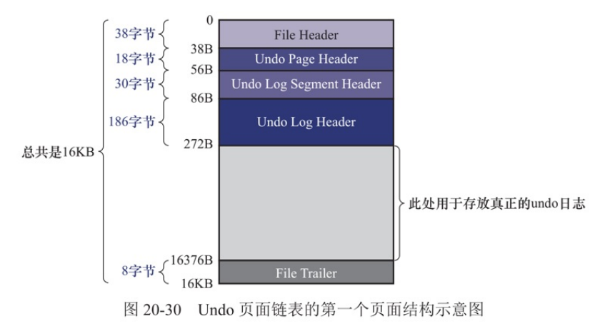
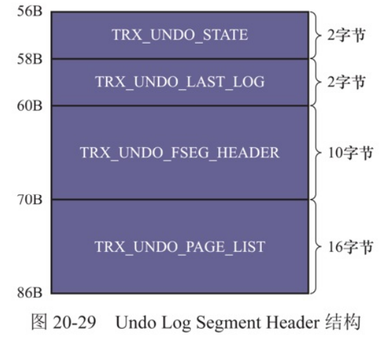

# 20 undo日志

## 关键字

> 1. 记录隐藏列、事务ID、回滚指针
> 1. undo日志回滚作用
> 1. MVCC

## 事务的回滚需求

> 事务需要`保证原子性`，如果事务的执行过程，服务器发生了错误，就需要将事务进行回滚（对部分语句进行回滚，对整个事务进行回滚）。
>
> InnoDB把`为了回滚而记录的东西称为undo日志`，对数据库进行改动（insert、delete、update）操作时，就需要进行记录，不同的操作类型产生的undo日志的格式是不一样的。
>
> - 插入操作，记录主键值，回滚时只需要根据主键值将相应的记录删除
> - 删除操作，把记录的内容记录，回滚时把删除前记录的内容重新插入

## 事务Id

### 分配Id的时机

> - 读写事务，只有在它第一次对某个表执行改动操作时，才分配事务Id
> - 只读事务，只能对`临时表`进行改动操作
> - 如果不为事务分配Id，则事务Id为默认值0。

### 事务Id的生成

> 事务Id与`隐藏列row_id`的分配策略类似，MySQL会维护一个全局变量，为事务分配Id后，就自增1，当它的值为256的倍数时，就会刷新到系统表空间页号为5的页面属性`Max Trx ID`（占8字节）中。
>
> 系统启动时，会将这个属性加载到对应的全局变量并加上256，这样就保证事务Id是递增的。

## 记录的隐藏列

> `聚簇索引`的记录除了会有用户定义的列外，还会有额外的隐藏列
>
> 1. `row_id`：作为主键Id（如果表中没有主键、或不可为Null的唯一索引）
> 2. `trx_id`：事务Id
> 3. `roll_pointer`：回滚指针，指向记录对应的undo日志

## undo日志的格式

> 为了保证事务的原子性，InnoDB在对记录进行改动操作时，需要创建相应的undo日志，一个事务执行过程中，可能会新增、修改、删除`多条`记录，所以需要记录多条undo日志，undo日志会从0开始编号。
>
> undo日志会存储在`fil_page_undo_log`类型的页面中。

### 插入操作的undo日志

> 插入一条记录的结果是记录被加入到数据页中，在创建对应undo日志时，只需要把这条记录的`主键值记录下来`，如果要回滚插入操作，只需要根据对应的主键值对记录进行删除操作。
>
> 
>
> **trx_undo_insert_log类型的undo日志**
>
> 1. `end of record`：本条记录的结束（即指向下一条日志开始）
> 2. `undo type`：日志的类型
> 3. `undo no`：日志对应的编号，一个事务中，日志编号从0开始，事务没提交，事务中产生的undo日志的编号递增1
> 4. `table id`：日志记录对应的表的Id
> 5. `主键列的信息列表`：<列占用的字节数，对应的值>
> 6. `start of record`：本条记录的开始（即指上一条日志结束）

> **提示**
>
> 向表插入记录时，实际上需要向聚簇索引、所有的二级索引都插入记录，不过，只需要针对`主键值`创建1条undo日志`，在回滚插入操作时，只需要知道这条记录的主键信息，根据主键信息对聚簇索引、二级索引相应的记录删除。
>
> InnoDB对undo日志的某些属性进行了压缩处理。

### 删除操作的undo日志

> 插入到数据页面的记录会根据记录头信息`next_record`组成一个单向链表（正常记录链表）。
>
> 被删除的记录是根据`next_record`属性组成了`垃圾链表`，数据页结构`Page Header`中有属性`page_free`指向垃圾链表的`头节点`。
>
> 
>
> **删除操作的2个阶段**
>
> 1. `delete mark`：将记录的`deleted_flag标识位`置为`1`，修改记录的trx_id、roll_pointer。
> 2. `purge`：进行`删除的事务提交后`，会有专门的线程把记录删除掉，将这个记录加入到垃圾链表头部，修改页面信息`page_n_recs`、`page_last_insert`、`page_free`、`page_garbage`（页面可重用的字节数），这条记录占用的存储空间可以被重新利用了。

> **提示**
>
> 删除记录后，会在页面的`page_garbage`增加相应的存储空间大小。
>
> `page_free`指向的是垃圾链表的头节点，`插入记录`时，首先判断垃圾链表`头节点占用的存储空间是否可以容纳这个新记录`。
>
> - 如果无法容纳新记录，则向页面申请新的存储空间来存储这条记录
> - 如果可以容纳新记录，则直接重用这部分的存储空间，并让`page_free`指向垃圾链表的下一条被删除的记录
>
> `直接重用垃圾链表的存储空间`会产生`碎片`，在页面空间快使用完前，碎片空间不会被利用。
>
> `页面空间快满时`，页面不能再为新记录分配空间时，就会查看`page_garbage`和`剩余空间`相加能否容纳这条新记录，如果可以，InnoDB就会尝试`重新组织页内的记录`。
>
> 重新组织的过程是，新开辟一个临时页，把页面的记录依次插入到临时页，再把临时页的数据复制到本页面中，这个过程会耗费性能。

> **trx_undo_del_mark_rec类型的undo日志**
>
> 1. end of record
> 2. undo type
> 3. undo no
> 4. table id
> 5. `info bits`：记录头信息的前4比特的值
> 6. `trx_id`：旧记录的事务Id
> 7. `roll_pointer`：旧的回滚指针的值
> 8. 主键列的信息
> 9. `len of index_col_info`：即下方“索引列信息列表”与本部分占用的字节数
> 10. `索引列的信息列表`：被索引的列的相关信息，<列在记录中的位置，占用字节数，对应的值>，如果`某个列被包含在某个索引中`，它的`相关信息`就要被记录到这个列表中
> 11. start of record
>
> 
>
> 在执行`delete mark前`，需要把记录的事务Id、回滚指针记录到undo日志中，这样可以通过`undo日志的回滚指针`找到上一次对这条记录进行改动产生的undo日志，undo日志被组织成一条链表，链表被称为版本链。

### 更新操作的undo日志

#### 不更新主键

> **被更新的列`不发生变化`**
>
> 前后记录的`列占用存储空间不变`，可以直接在原记录的基础上进行修改
>
> 
>
> **被更新的列`发生变化`**
>
> 被更新的列前后占用的存储空间不一样，需要将记录从聚簇索引页面中删除，再根据更新后的值创建记录插入到页面中。这里的`删除`是`将记录移动到垃圾链表`中，并修改页面中的统计记录`page_free`、`page_garbage`。
>
> 删除是由用户线程同步进行的。之后再根据各列更新后的值创建一条新的记录，插入到页面中，插入的过程也是先判断`垃圾链表头节点的存储空间能否容纳新记录`。
>
> 不更新主键产生的undo日志的格式是`trx_undo_upd_exist_rec`。
>
> 
>
> **trx_undo_upd_exist_rec类型的undo日志**
>
> 1. `n_updated`：被更新列的个数
> 2. `被更新的列的更新前相关信息`：<列在记录中的位置，原数据占用字节数，对应的值>
> 3. 与删除产生的undo日志类似
> 4. 如果更新的列有索引列，那就会添加`索引列的信息列表`部分

#### 更新主键

> 如果更新了某条记录的主键值，这条记录的在聚簇索引中位置就会发生改变，InnoDB会对这条记录进行两部操作
>
> 1. 对记录进行`delete mark`操作，事务提交前，只对旧记录进行`delete mark`操作，事务提交后，后台线程会对这条旧记录进行`purge`操作，只对记录进行`delete mark`操作是因为`别的事务`可能会`同时访问这条记录`，这个功能是`MVCC`。
> 2. 根据各列更新后的值创建一条记录，将其插入到聚簇索引对应位置中。
>
> 对主键更新的更新操作会产生2条undo日志（其实还有其他类型的undo日志）
>
> 1. 进行`delete mark`删除产生的`删除操作undo日志`
> 2. 之后新插入的记录的`插入操作undo日志`

### 增删改操作对二级索引的影响

> 插入、删除操作对二级索引的影响与聚簇索引差不多，对于更新操作，如果没有涉及到二级索引列，那就不需要对二级索引进行任何操作。
>
> 如果涉及到了二级索引的`键值`，就需要进行`delete mark`、`插入新记录`的操作。
>
> 二级索引中`没有事务Id、回滚指针`，但对二级索引进行`改动操作`时，需要对页面`Page Header`结构中属性`page_max_trx_id`进行修改，修改为当前事务Id。

## fil_page_undo_log页面

> 有一种专门用来存储undo日志的页面，这种页面的通用结构是
>
> 1. `File Header`
> 2. `Undo Page Header`
> 3. 其他内容
>     - `Undo Log Segment Header`，链表第一个页面才有的部分
>     - `Undo Log Header`，链表第一个页面才有的部分
> 4. `File Header`
>

> **Undo Page Header的结构**
>
> 1. `trx_undo_page_type`，undo页面类型可分为2大类
>     - `insert undo日志`：`insert`操作的undo日志
>     - `update undo日志`：`update`、`delete`操作的undo日志
> 
> 
> 
>2. `trx_undo_page_start`：第一条undo日志在页面中的`起始`偏移量
> 
>3. `trx_undo_page_free`：最后一条undo日志在页面中的`结束`偏移量
> 
>4. `trx_undo_page_node`：页面组成链表需要的结构
> 
>`不同大类的undo日志不可以混着存储。`

> **提示**
>
> `insert`操作产生的undo日志在事务提交后可以直接删除
>
> 其他操作产生的undo日志类型需要为MVCC服务。

## Undo页面链表

### 单个事务中的undo页面链表

> 一个事务中可能有多个语句，一个语句可能会对多条记录进行改动，对每条记录进行改动前会可能产生1或2条undo日志，所以一个事务可能产生多条undo日志，可能在一个页面中中存放不下，这时需要使用多个页面，并将页面组织成链表。
>
> 链表中第一个页面称为`first undo page`，其余的页面被称为`normal undo page`。
>
> 因为不同大类的undo日志不能存储在同一个页面中，所以一个事务的执行过程中，可能产生`2个`undo页面链表
>
> 如果考虑临时表，就为4个undo页面链表，因为InnoDB规定对普通表、临时表改动产生的undo日志需要分开存储。
>
> 分配链表的方式是`按需分配`。
>
> 
>
> **多个事务中的undo页面链表**
>
> 为了提高undo日志的写入效率，`不同事务`执行过程中产生的undo日志需要`写入不同的undo页面链表`。

### undo日志写入过程

#### 段

> 段是一个逻辑概念，本质上是多个零散页面和完整的区组成的，一个B+树索引被划分为2个段，叶子节点段、非叶子节点段，每一个段对应着`INode Entry`结构，为了定位一个段，InnoDB中有一个`Segment Header`的结构：
>
> 1. `Space ID` of the INode Entry，4字节，所在表空间
> 2. `Page Number` of the INode Entry，4字节，所在页面的页号
> 3. `Byte Offset` of the INode Entry，2字节，页内的偏移量

#### Undo Log Segment Header属性

> InnoDB规定每一个undo页面链表都对应着一个段，称为`Undo Log Segment`，也就是说，链表中的页面是从这个段中申请的，undo页面链表中的`第一个页面`有一个`Undo Log Segment Header`部分，包含了相关信息：
>
> 1. `trx_undo_state`：undo页面链表的状态
>     - 活跃：活跃的事务正在向这个undo页面链表中写入undo日志
>     - 被缓存：页面等待被重用
>     - 等待被释放：对于`insert`类型的undo链表来说，事务提交后，如果这个链表不能被重用，则处于这种状态。
>     - 等待被清理（purge）：对于`update`类型的undo链表来说，`事务提交后`，如果链表`不能被重用`，则处于这种状态。
>     - prepared：用于存储与prepared阶段的事务（分布式事务中出现）
> 2. `trx_undo_last_log`：本undo页面链表中最后一个`undo log header`的位置
> 3. `trx_undo_fseg_header`：Segment Header结构信息
> 4. `trx_undo_page_list`：undo页面链表的基节点（只存在于undo页面链表的第一个页面）

#### Undo Log Header属性

> 事务在向undo页面写入undo日志时，采用的方式是简单粗暴的，写入一条就写入另一条，`undo日志是紧密无间`的，写完一个页面后，就再从段中申请新的页面，把这个页面插入到链表中，继续从这个新页面写入undo日志。
>
> InnoDB认为，`同一个事务向一个undo页面写入的undo日志是一个组`，在写入一组undo日志时，会在这组undo日志前先记录一下这个组的属性，InnoDB把这些属性存放在`Undo Log Header`中。
>
> undo页面链表在`真正写入undo日志前`，都会填充`Undo Page Header`、`Undo Log Segment Header`、`Undo Log Header`。
>
> 
>
> **Undo Log Header的结构**
>
> 1. `trx_undo_trx_id`：生成本组undo日志的事务Id
> 2. `trx_undo_trx_no`：事务序号（后提交的事务序号大）
> 3. `trx_undo_del_marks`：记录本组undo日志是否包含由`delete mark操作`产生的undo日志
> 4. `trx_undo_log_start`：本组undo日志第一条undo日志在页面中的偏移量
> 5. `trx_undo_xid_exists`：本组undo日志是否包含XID信息
> 6. `trx_undo_dict_trans`：标记本组undo日志是否由DDL语句产生的
> 7. `trx_undo_table_id`：如果上面字段为真，则表示DDL语句操作的表Id
> 8. `trx_undo_next_log`：下一组undo日志在页面中的偏移量
> 9. `trx_undo_prev_log`：上一组undo日志在页面中的偏移量
> 10. `trx_undo_history_log`：代表一个`History链表的节点`
> 11. `XID信息`

#### 小结

> 对于没有被重用的undo页面链表，链表的第一个页面在真正写入undo日志前，会填充`Undo Page Header`、`Undo Log Segment Header`、`Undo Log Header`3个属性。
>
> 对于其他页面，在真正写入undo日志前，只会填充`Undo Page Header`。
>
> 链表基节点存放在第一个页面`Undo Log Segment Header`中。
>
> 链表节点信息存放在每个undo页面的`Undo Page Header`中。

## 重用Undo页面

> 前文见过，为了提高并发执行事务写入undo日志的效率，InnoDB为每个事务单独分配了undo页面链表，但这可能会浪费undo页面的存储空间（大部分事务执行过程中可能只会修改少量的记录），因此在某些情况下，InnoDB支持重用这些undo页面，但要符合一下`2个条件`：
>
> 1. 链表中只有一个undo页面，如果链表的页面比较多，而在该事务提交后被重用，新的事务即使没有向页面写入很多的undo日志，也要维护这个很多页面的链表，这就造成了浪费。
> 2. undo页面`已使用的空间`小于页面空间的3/4，重用空余空闲小的页面得不到好处。

### insert undo链表

> insert undo链表中只存储insert类型的undo日志，这种类型的undo日志在事务提交后，就可以被清除，所以事务提交后，在`重用insert undo链表`时，可以直接把之前事务写入一组undo日志覆盖。
>
> 重用undo页面时，会写入`新的 Undo Log Header`，还会适当调整`Undo Page Header`、`Undo Log Segment Header`、`Undo Log Header`属性。

### update undo链表

> update操作类型的undo日志在事务调提交后，不可以立刻删除（undo日志被用与MVCC），如果要重用update undo 链表，就不能覆盖之前生成的undo日志，而需要在页面空闲部分写入新的一组undo日志。

## 回滚段

### 概念

> 在同一时刻，不同事务拥有的undo页面链表是不同的，并且系统中会存在许多undo页面链表，为了更好管理这些链表，InnoDB设计了`Rollback Segment Header`页面存放undo页面链表的`第一个页面的页号`，页号被称为`undo slot`。
>
> 
>
> **Rollback Segment Header页面结构**
>
> 1. `trx_rseg_max_size`：回滚段中，undo页面链表的页面数量的最大值限制（4字节，最大值为`0xFFFFFFFF`，表示无限大
> 2. `trx_rseg_history_size`：History链表占用页面数量
> 3. `trx_rseg_history`：History链表的基节点
> 4. `trx_rseg_header`：对应的`Segment Header`结构
> 5. `trx_rseg_undo_slots：`各undo页面链表的页号的集合（页号占用4字节，共存储1024各undo solt）。
> 6. `没用`
> 7. `File Trailer`
>
> InnoDB规定，每一个回滚段页面都对应着一个段（回滚段），回滚段只有一个页面（5.7.22版本）。

#### 从回滚段中申请undo页面链表

> 初始状态下，由于没有为事务分配任何的undo页面链表，所以回滚段页面中的所有undo slot都为`fil_null(0xFFFFFFFF)`，表示undo slot不指向任何页面。当需要为事务分配undo页面链表时，就会从回滚段的第一个undo slot开始，判断undo slot是否为`fil_null`：
>
> - `是fil_null`，就会在表空间创建一个段`Undo Log Segment`，然后从段中申请一个页面作为页面链表的`第一个页面`，把`undo slot`的值设置为这个页面的地址，这时就意味着这个页面被分配给这个事务。
> - `不是fil_null`，意味着这个`undo slot`被分配给一个事务，需要判断下一个undo slot是否为`fil_null`。
> - 如果所有的undo slot都被占用，就表示当前事务无法在获得新的undo页面链表，系统将会报错。

##### 事务提交后，链表的状态变化

> 如果undo slot指向的undo页面链表符合被重用的条件（链表只有一个页面，页面已使用的空间小于3/4），这个undo页面链表的状态（第一个页面中`trx_undo_state`）就会被设置为`trx_undo_cached`，`insert undo`链表加入`insert undo cached 链表（`update则加入`update undo cached`链表）。

>  如果undo slot指向的链表不符合重用条件，那就会对2大类的undo日志类型进行不同的处理
>
> - insert undo链表：将链表的状态设置为`trx_undo_to_free`，之后链表会被释放掉，对应的undo slot会被设置为`fil_null`
> - update undo链表：将链表的状态设置为`trx_undo_to_purge`，将对应的undo slot设置为`fil_null`，而是将事务的一组undo日志加入到`History链表`，undo页面链表对应的段不会被释放掉，而是为MVCC服务。

### 多个回滚段

> 经过发展，InnoDB定义了128个回滚段，对应128个`Rollback Segment Header`，这些页面被存放到系统表空间页号为5的页面中，存储的结构是8字节（`space Id`、`Page number`，回滚段可以被分配到不同的表空间）。

### 回滚段的分类

> 回滚段有128个，这些回滚段可以分为2类
>
> - `0、33~127号`：对`普通表`进行改动时产生的`undo页面链表`在这一类的回滚段中分配undo slot，第0号的回滚段对应的`RollBack Segment Header页面`只能在系统表空间中，其他的可以在自己配置的`undo表空间`中。
> - `1~32号`：对`临时表`进行改动时产生的`undo页面链表`在这类回滚的中分配undo slot，这些回滚段对应的页面只能在临时表空间中。
>
> **分类的原因**
>
> undo页面是`fil_page_undo_log页面`，在修改页面时需要先写对应的redo日志，这样在系统崩溃后，可以进行恢复。对这个页面写入操作也是如此，需要先写redo日志，redo日志类型还有`mlog_undo_hdr_create`、`mlog_undo_insert`、`mlog_undo_init`。
>
> 对于临时表来说，修改临时表产生的undo日志只需要在系统运行过程中有效，系统发生崩溃后恢复也不需要恢复这些undo日志。

> **提示**
>
> MySQL 5.7.22版本中，只对普通表进行改动，只会为事务分配针对`普通表`的回滚段，而对临时表进行改动，会为事务分配2类的回滚段。

#### roll_pointer的组成

> 聚簇索引记录有`roll_pointer`隐藏列（有些undo日志类型也有），它指向一条undo日志的地址，组成是：
>
> 1. `is_insert`：标识是否指向`trx_undo_insert大类`的undo日志
> 2. `rseg id`:回滚段的编号（0~127）
> 3. `page number`：指针指向的undo日志所在的页面的页号
> 4. `offset`:undo日志在页面中的偏移量

#### 为事务分配undo页面链表的过程

> 1. 事务在执行过程中`首次改动普通表记录`，就会在系统表空间第5号页面`分配一个回滚段`（获取页面地址），之后事务再`对普通表进行改动`，不会重新分配。
> 2. 分配到回滚段后，首先查看回滚段的2个`cached链表`，`insert`操作、`delete`操作去对应的cached链表（`insert undo cached链表`、`update undo cached链表`）中查找，如果`有缓存的undo slot`，就把这个undo slot分配给事务，如果没有缓存的undo slot，就到`Rollback Segment Header`页面找可以的undo slot分配给事务。
> 3. 找到undo slot后
>     - 如果undo slot是cached链表中获取的，那它对应的`Undo Log Segment`已经分配
>     - 否则，需要重新分配`Undo Log Segment`并从中申请页面作为`undo页面链表`的`第一个页面`，再将页号写入undo slot中。
> 4. 事务把undo日志写入到undo页面链表中。
>
> `并发事务`也可以`分配相同的回滚段`，只要分配`不同的undo slot`。

## 回滚段的配置

> 系统启动选项`innodb_rollback_segments`是用来配置回滚段数量的：
>
> - 设置为1，只有1个针对普通表回滚段
> - 设置大于33，则为`数量-32`作为针对普通表回滚段的数量

### 配置undo表空间

> 默认情况下，33~127号的回滚段是放到系统表空间的，但可以进行配置放到自定义undo表空间，但只能再系统初始化时使用，初始化完成后就不可以修改。
>
> - `innodb_undo_directoy`：指定undo表空间所在的目录
> - `innodb_uodo_tablespaces`：指定undo表空间的数量
>
> 
>
> - 33~127的页面将被`平均`分布到不同的undo表空间中
> - 如果自定义了undo表空间，第0号回滚段将处于不可用状态
> - 设立undo表空间的好处是undo系统表空间的文件大到一定程度时，可以自动对`undo表空间`进行截断

## undo日志在崩溃恢复时的作用

> 服务器崩溃恢复时，需要将按照redo日志将各个页面数据恢复，保证事务的`持久性`，但是，那些`未提交`的事务写的`redo日志可能被刷入磁盘`，这些redo日志对应的`修改的页面可能被恢复`。
>
> 为了保证事务的`原子性`，需要将`未提交`事务进行的修改`进行回滚`，这时就需要依靠undo日志了。
>
> 1. 我们可以通过系统表空间的第5号页面`定位128个回滚段`
> 2. 寻找回滚段中`值不为fli_null的undo slot`
> 3. 在undo slot中找到undo页面链表的`第一个页面`中属性`trx_undo_state`，查看它的状态
> 4. 针对为`活跃状态`的undo页面链表，在`Undo Segment Header`找属性`trx_undo_last_log`，这个属性可以找到链表最后的`Undo Log Header`的位置，从`Undo Log Header`找到对应的`事务Id`和其他信息
> 5. 这个事务Id就是`未提交`事务的Id，通过undo日志记录的信息可以将事务对页面进行的修改进行回滚，保证`原子性`
