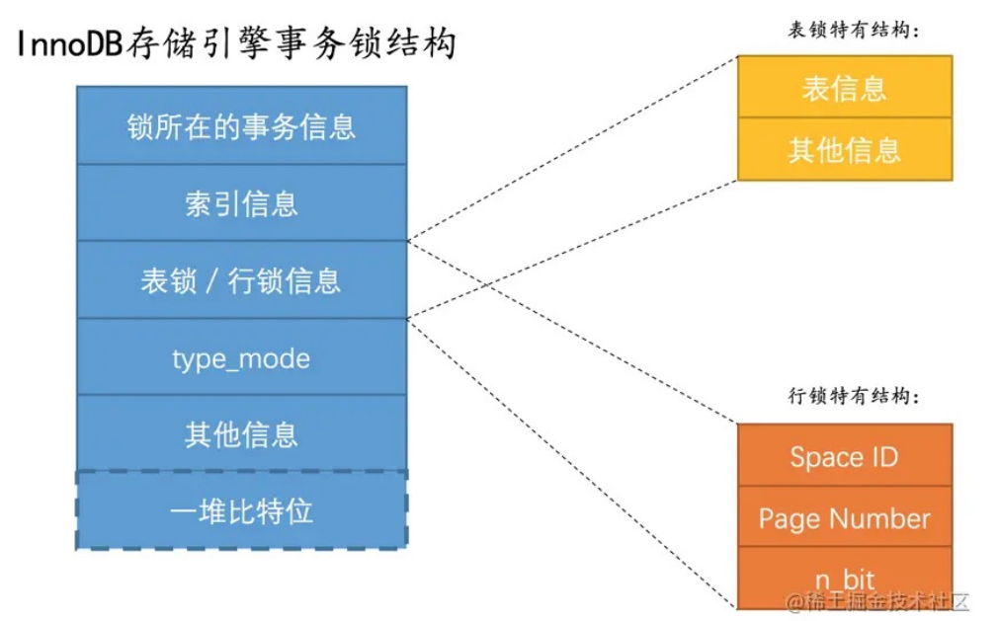

# 22 锁


## 关键字

> 1. 行锁、表锁
> 2. 锁的模式、意向锁
> 3. 加锁的类型判断依据、隔离级别、匹配模式


## 事务一致性问题

> 出现并发事务对同一数据进行`读写`、`写写`时会出现一致性问题，对于`写写`情况，多个未提交的事务对于同一记录进行改动时，需要串行执行，实现的方式是对记录进行`加锁`。


### 写写情况

> 事务对记录进行修改时，查看内存中是否有`锁结构与该记录关联`，锁的基本信息有`trx信息`（与锁关联的事务）、`is_waitting`（标志是否等待），持有锁的事务提交后，会唤醒等待中事务。


### 读写情况

> 不同隔离级别下可以解决不同的事务并发问题，MySQL的`可重复读`隔离级别下，`很大程度解决了幻读`，MySQL解决`脏读`、`不可重复读`、`幻读`的方案有：
>
> 1. `MVCC`：通过生成`Read View`，控制了事务对记录版本的`可见性`，使得事务只能读取到Read View生成之前已提交的事务做的修改，MVCC中，读取记录的历史版本与改动记录的最新版本并不冲突，`读写不冲突`。
> 2. `加锁`：有些业务场景下不允许读取记录的历史版本，而要读取记录的最新版本，对于这种需求可以使用加锁完成，这将使得`读写`操作需要串行执行。


> **提示**
>
> 使用加锁解决`幻读`的方式会有点复杂，因为需要找到新插入的记录。


### 一致性读

> 事务利用`MVCC`的读取操作称为`一致性读`、`快照读`，读已提交、可重复读的隔离级别下，`普通select`语句都是这种方式。这种方式不会对任何记录加锁。


### 锁定读

> MySQL中的锁有：
>
> - 共享锁（Shared Lock，S锁）：读取记录时，需要获取记录的S锁，S锁与X锁不兼容。
> - 排它锁（Exclusive Lock，X锁）：修改记录时，需要获取记录的X锁，X锁与S锁、X锁不兼容。


#### 锁定读的语句

> 对读取的记录加S锁

```sql
select *
from single_table lock in share mode;
```


> 对读取的记录加X锁

```sql
select *
from single_table for update;
```


#### 写操作

> 写操作包括`insert`、`update`、`delete`，执行这些操作会加锁
>
> - update：对记录进行update操作有3种情况
>     - 没修改键值且更新的列占用的存储空间不变，需要在B+树定位到记录的位置，再获取记录的`X锁`，然后在记录的原位置进行修改
>     - 没修改键值但至少1个更新的列占用的空间有变化，需要定位到该记录，获取记录的`X锁`，`将记录删除`，最后再`插入一条记录`，被删除的记录上的`锁会被转移到新插入的记录上`
>     - 更新了键值，就需要对原记录进行`delete`、执行`insert`操作插入更新后的记录
> - delete：在B+树定位到记录的位置，再获取记录的`X锁`，执行`delete mark`操作
> - insert：一般情况下，新插入一条记录受`隐式锁`保护，不在内存中创建锁结构
>
> 
>
> 在B+树定位到被修改记录的位置，再获取记录的`X锁`看做成是`获取X锁的锁定读操作`。
>
> 一般情况下，事务提交或终止时，事务加的锁才会释放。


## 多粒度锁

> 一个事务可以`对表加锁`，表锁的粒度比行锁大，性能消耗低，表锁有
>
> - S锁，别的事务可以获取表中`记录S锁`、`表S锁`
> - X锁，与S锁、X锁不兼容
>
> 
>
> 表的X锁与其他锁不兼容，在加`表X锁`时，需要判断表是否有`记录S、X锁`，为了提高效率，InnoDB设计了`意向锁`：
>
> - 意向共享锁（Intention Shared Lock，`IS锁`）：事务准备加`记录S锁`时，向表加一个`IS锁`
> - 意向排它锁（Intention Exclusive Lock，`IX锁`）：事务准备加`记录X锁`时，向表加一个`IX锁`
> - `IS锁`与`IX锁`兼容
> - `IX锁`与`IX锁`兼容
> - `表X锁与任何锁不兼容`


## MySQL的行锁与表锁

### InnoDB表锁

> **表S、X锁**
>
> 对表进行`select`、`insert`、`update`、`delete`操作时，`不会加表锁（不讨论意向锁）`。
>
> `alter table`、`drop table`的`DDL`语句和`增删改查`操作，这2类语句操作不能同时执行，其中的一类会被阻塞，但这是通过`server层`使用`元数据锁`实现的，并不是使用InnoDB的表锁实现的。
>
> 
>
> InnoDB的表锁只有在`特殊情况下`会使用，在系统变量`autocommit = 0`、`innodb_table_locks = 1`情况下，可以执行一下语句：
>
> - `lock tables single_table read;`：表S锁
> - `lock tables single_table write;`：表X锁
> - 使用InnoDB的表锁会降低并发能力
>
> 
>
> **表IS、IX锁**
>
> 即前文介绍的锁
>
> 
>
> **表级Auto-inc锁**
>
> 系统给`auto_increment`修饰的列进行递增赋值的方式有2个：
>
> - Auto-inc锁：插入语句执行时要加锁，然后为插入语句分配递增值，没有持有Auto-inc锁的事务执行插入操作会被阻塞，`插入语句完成释放锁`（插入的`记录数量不能确定`，一般使用这种方式）
> - 轻量级锁：插入语句生成`auto_increment`修改列的分配的值时加锁，`生成需要的值后`就将锁释放（插入记录的值可以确定，一般采用这种方式）
>
> 
>
> **innodb_autoinc_lock_mode 系统变量的值**
>
> - `0`：一律使用Auto-inc锁
> - `1`：2中方式混用
> - `2`：一律使用轻量级锁（可能造成不同事务的自增值是交叉的，主从复制场景不安全）


### InnoDB行锁

> 行锁有`Record Lock`、`Gap Lock`、`Next-Key Lock`、`Insert Intention Lock`
>
> **Record Lock (lock_rec_not_gap)**
>
> 对一条记录加的锁
>
> 
>
> **Gap Lock (lock_gap)**
>
> MySQL在`可重复读`隔离级别下，很大程度解决了`幻读`，解决的方式除了`MVCC`外，还有加`间隙锁`，给记录加`间隙锁`，不允许事务在`范围(上一条记录, 被加锁记录)`插入记录，只有持有了`间隙锁`的事务提交后，将锁释放，其它事务才可以在该范围内插入记录。
>
> 
>
> 间隙锁有S、X之分，但它们的作用是一样的，防止`幻影记录`的插入。
>
> 如何保证`范围(最后一条记录, +∞)`不插入幻影记录？在数据页中，有`2条伪记录`，对应`上界`（页面最小的记录）、`下界`（页面最大的记录），只要对`下界`加上`间隙锁`，就可以保证该范围不出现幻读。
>
> 
>
> **Next-Key Lock (lock_ordinary)**
>
> `临键锁`本质是`记录锁`与`间隙锁`的组合，能保护记录且阻止新记录插入到记录前。
>
> 
>
> **Insert Intention Lock (lock_insert_Intention)**
>
> 事务在插入一条记录时，需要`判断插入位置是否有间隙锁`，如果有，就需要在内存生成一个`插入意向锁`并等待，`持有意向锁的事务不会互相阻塞`，意向锁不会阻止其他事务继续在该记录上加任何类型的锁。
>
> 
>
> **隐式锁**
>
> 在内存生成锁有一定的成本，InnoDB有隐式锁，一般情况下，插入操作不会在内存中生成锁，但这会出现一些问题需要解决：
>
> - 有事务立即执行`锁定读`，如果允许这种情况，就出现`脏读`
> - 有事务立即执行对这条记录继续`更新操作`，如果允许这种情况，就出现`脏写`
>
> 解决上面的问题需要依靠`事务Id`：
>
> - `聚簇索引记录`：记录上有`trx_id`记录着最后改动此记录的事务Id，如果要对记录加锁，首先会判断事务Id对应的事务是否是`活跃状态`，如果不是则正常读取，如果是则`帮助该事务`对记录`加X锁`，并给自己加对应的锁，设置为等待状态。
> - 二级索引记录：索引记录上没有`trx_id`，但二级索引页面`Page Header`有属性`page_max_trx_id`记录了最近对页面更改的`最大事务Id`，如果当前事务Id大于该值，说明对该页面修改的事务已经提交，否则需要回表在聚簇索引执行上面的判断
>
> 隐式锁起到了`延迟创建锁`的作用，避免部分消耗，它起到的作用是一样的


> **提示**
>
> 在InnoDB的实现中，InnoDB的行锁是与记录一一对应的，gap锁在实现上也是为某条记录生成一个锁结构，锁结构的类型是gap锁，gap锁的功能就是每当有`别的事务插入记录时`，会`检查`一下待插入记录的`下一条记录`上是否已经有一个`gap锁`的锁结构，如果有的话就进入阻塞状态


### InnoDB锁内存结构

> InnoDB在对多条记录加锁时，记录的锁可以`放到一个锁结果`，但要`符合以下条件`：
>
> 1. 在同一个事务进行的加锁
> 2. 被加锁的记录在同一个页面
> 3. 加锁类型一样
> 4. 等待状态一样
>
> 
>
> **锁的结构**
>
> 
>
> 1. `锁的事务信息`：指针，可以得到事务的相关信息
>
> 2. `索引信息`：对`行锁`来说，要记录记录所属的索引
>
> 3. `表锁`/`行锁信息`
>    - 表锁：对哪个表加锁
>     
>    - 行锁
>     
>        - Space Id：记录所在的表空间
>         - Page Number：记录所在页面的页号
>         - n_bits：`比特位的个数`，对应下方的`一堆比特位`
> 
>
> 
>4. `type_mode`：32位的比特位，分为3部分
>     - `lock_mode`：低4位
> 
>        - lock_IS
>          - lock_IX
>          - lock_S
>          - lock_X
>          - lock_auto_inc
>      - `lock_type`：5~8位
>         - lock_table
>         - lock_rec
> 
>    - `rec_lock_type`：其余高位
>         - lock_rec_not_gap
>         - lock_gap
>         - lock_ordinary
>         - lock_insert_intention
>         - lock_wait：表示锁中`is_waitting`，对应的比特位为1，则为等待状态
>         - 其他类型
> 
>5. `其他信息`：管理系统运行过程中的各种锁结构，而设计了各种哈希表、链表
> 6. `一堆`比特位：对`行锁`来说，比特位对应着页面中的记录，比特位映射记录头信息中`heap_no`，为了编码方便，映射的方式比较特殊


> **提示**
>
> 假如事务`T1`对`记录R`加锁后，事务`T2`对`记录R`加锁，但状态会`被设置为等待状态`，并不再继续对其他记录加锁（`T2`要对多条记录加锁，但一开始对`记录R`加锁就等待），当`T1`释放`记录R`的锁后，`T2`可以获得`记录R`的锁，并继续对其他记录加锁，并且能复用`T1`对`记录R`加锁的`锁结构`。


## 语句加锁过程

> - 普通select语句
> - 锁定读语句
> - 半一致性语句
> - insert语句


### 表结构

```sql
create table hero (
    id      int          not null primary key,
    name    varchar(100) null,
    country varchar(100) null
);

create index idx_name
    on hero (name);

insert into hero
values (1, 'l刘备', '蜀'),
       (3, 'z诸葛亮', '蜀'),
       (8, 'c曹操', '魏'),
       (15, 'x荀彧', '魏'),
       (20, 's孙权', '吴');
```


### 普通select语句

> 在不同的隔离级别下，普通select语句具有不同的表现，说MySQL的`可重复读`隔离级别级别下`很大程度`避免了`幻读`，出现下面这种情况会出现幻读。

```sql
begin;
select * from hero where id =30;

# 事务T2执行并提交 insert into hero values(30,'x','x');
update hero set name='xx' where id=30;

# 幻读 可以查询到id为30的记录
select * from hero where id =30;
```


#### 序列化隔离级别

> 系统变量`autocommit = 0`时，普通的select语句会被转换为`S锁的锁定读`，如果该变量为`1`，普通的select语句不会加锁，因为自动提交默认一个事务只有一个语句，只执行一条语句不会出现`不可重复读`、`幻读`。


### 锁定读

> 锁定读包括：
>
> - `select ... lock in share mode`
> - `select ... for update`
> - `update`
> - `delete`
>
> 
>
> **为记录加锁会受其他因素影响**
>
> 1. 事务的`隔离级别`
> 2. 语句执行时使用的`索引类型`
> 3. `匹配模式`：扫描区间是`单点扫描区间`，那么匹配模式就是`精确匹配`
> 4. 是否是`唯一性搜索`：在扫描某个区间的记录前，就确定了`扫描区间只有一条记录`称为`唯一性搜索`，查询需要符合一下条件：
>     - 匹配模式是精确匹配
>     - 使用的索引是主键索引、唯一索引（查询条件不可以是`索引列 is Null`的形式，索引包含多个列，需要利用所有列）
> 5. 语句类型
>
> 
>
> **一般语句加锁过程**
>
> 事务执行过程中加的锁一般需要在事务提交、终止时才会释放锁，但在隔离级别在`读已提交及以下`，会提前将不符合查询条件记录的锁释放。
>
> 把锁定读的执行看作是`依次读取若干个扫描区间记录`，一般情况下，读取扫描区间记录的过程是：
>
> 1. 在B+树子节点定位扫描区间的第一条记录，作为`当前记录`
> 2. 对记录加锁：一般情况下，`可重复读级别及以上`加`临键锁`，`读已提交及以下`加`记录锁`，（等值匹配，可以判断是否满足条件）
> 3. 判断`索引条件下推`的条件是否成立：`条件索引下推`只适用于select语句
>
>     - 这个过程`不会释放锁`
>     - 符合索引条件下推条件：`执行4`
>     - 不符合索引条件下推条件：`执行7`
>     - 这个过程会判断是否符合扫描区间，不符合扫描区间则向server层返回`查询完成`信息
>
> 
>
> 4. 回表操作：使用的是二级索引则回表，对聚簇索引记录加`记录锁`
>
> 5. 判断边界条件是否成立
>
>     - 不符合边界条件：向server层返回`查询完成`的信息（`读已提交及以下`会`释放锁`）
>
> 
>
> 6. server层判断`条件`是否成立
>
>     - 条件成立：将记录发送给客户端
>     - 条件不成立：`读已提交及以下`会`释放锁`
>
> 7. 获取下一条记录，重新`执行2`


> **提示**
>
> `update`、`delete`语句，对被更新、被删除的二级索引记录加的锁是`隐式锁`，`读已提交隔离级别及以下`采用的是`半一致性读`。


> 查询的匹配模式是`精确匹配`
>
> - 隔离级别`读已提交及以下`：不会为`扫描区间后的下一条记录`加锁
> - 隔离级别`可重复读及以上`：为下一条记录加`间隙锁`，扫描区间`没有记录`也加`间隙锁`（不是精确匹配，则加`临键锁`）

```sql
select *
from hero
where name = 'c曹操' for update;
```

| name                       | id   |
| -------------------------- | ---- |
| c曹操 `临键锁（可重复读）` | 8    |
| l刘备 `间隙锁（可重复读）` | 1    |
| s孙权                      | 20   |
| x荀彧                      | 15   |
| z诸葛亮                    | 3    |


> 扫描区间`没有记录`加`间隙锁`（l刘备记录）

```sql
select *
from hero
where name = 'g关羽' for update;
```

| name                       | id   |
| -------------------------- | ---- |
| c曹操                      | 8    |
| l刘备 `间隙锁（可重复读）` | 1    |
| s孙权                      | 20   |
| x荀彧                      | 15   |
| z诸葛亮                    | 3    |


> 不是精确匹配，则加`临键锁`

```sql
select *
from hero
where name > 'd'
  and name < 'l' for update; 
```

| name                       | id   |
| -------------------------- | ---- |
| c曹操                      | 8    |
| l刘备 `临键锁（可重复读）` | 1    |
| s孙权                      | 20   |
| x荀彧                      | 15   |
| z诸葛亮                    | 3    |


> 查询使用`聚簇索引`，扫描区间是`左闭右开`则定位的扫描区间的`第一条记录`将使用`记录锁`

```sql
select *
from hero
where id >= 8 for update;
```

| id                                                    | name    |
| ----------------------------------------------------- | ------- |
| 1                                                     | l刘备   |
| 3                                                     | z诸葛亮 |
| 8  `记录锁（可重复读，因为 id 是唯一的，使用记录锁）` | c曹操   |
| 15  `临键锁（可重复读）`                              | x荀彧   |
| 20  `临键锁（可重复读）`                              | s孙权   |
| 下界 `临键锁（可重复读）`                             |         |


> 查询是`唯一性搜索`，只要记录没有被`delete mark`，则加`记录锁`

```sql
select * from herowhere id = 8 for update;
```


> `从右到左`扫描且隔离级别`可重复读及以上`，则匹配的第一条记录的`下一条记录`加`间隙锁`

```sql
select * from hero force index (idx_name) where name > 'c曹操'  and name <= 'x荀彧'  and country != '吴' order by name desc for update;
```

| name                         | id   |
| ---------------------------- | ---- |
| c曹操                        | 8    |
| l刘备 `临键锁（可重复读）`   | 1    |
| s孙权 `临键锁（可重复读）`   | 20   |
| x荀彧 `临键锁（可重复读）`   | 15   |
| z诸葛亮 `间隙锁（可重复读）` | 3    |


### 半一致性读

> 隔离级别`读已提交及以下`执行`update`语句时将使用`半一致性读`，当update语句读取已经被其他事务加锁的记录时，InnoDB会将该记录`最新版本`读出来，判断版本是否符合update的`查询条件`，如果符合，则对其加锁（防止update语句被别的事务阻塞），如果不符合则跳过，半一致性读只适用于对聚簇索引记录加锁的情况。


### Insert语句

> insert语句一般情况下是依靠`隐式锁`保护插入的记录的，事务在插入一条记录前，需要定位到B+树的位置，如果下一条记录加了`间隙锁`，事务就会为该记录加上`插入意向锁`，事务进入等待状态。


#### 特殊情况

> **重复键**
>
> 插入一条新记录时，需要确定新记录在B+树中的位置，在确定位置时发现记录中的`主键、唯一索引列`与`待插入的记录的主键、唯一索引列`相同时，就会报错。在报错前，会为该记录将锁（记录锁或临键锁）。
>
> 不管在那个隔离级别，对唯一二级索引加的是`临键锁`，这是因为需要`间隙锁`来保证`记录的唯一性约束`
>
> 
>
> **外键检查**
>
> 设置外键后，对子表进行插入时需要进行外键检查
>
> - 在主表上对应列上`找到值`：往子表插入记录前，会对主表的对应记录加`S记录锁`
> - 在主表上对应列上`找不到值`：插入失败，需要对记录加`间隙锁（可重复读）`


## 查看事务加锁情况

> INNODB_LOCKS、INNODB_LOCK_WAITS表在MySQL 8被移除

```sql
select * from information_schema.INNODB_TRX;
select * from information_schema.INNODB_LOCKS;
select * from information_schema.INNODB_LOCK_WAITS;
```


```sql
show engine innodb status;
# 设置系统变量，可以查看更多内容set global innodb_status_output_locks = on;
```

```bash
# 事务部分
------------
TRANSACTIONS
------------
Trx id counter 63843
Purge done for trx's n:o < 63783 undo n:o < 0 state: running but idle
History list length 0
LIST OF TRANSACTIONS FOR EACH SESSION:
---TRANSACTION 284106697672496, not started
0 lock struct(s), heap size 1136, 0 row lock(s)
---TRANSACTION 63842, ACTIVE 428 sec
2 lock struct(s), heap size 1136, 1 row lock(s)
MySQL thread id 25, OS thread handle 16316, query id 2700
localhost 127.0.0.1 root

# 事务部分，更多内容
------------
TRANSACTIONS
------------
Trx id counter 63845
Purge done for trx's n:o < 63783 undo n:o < 0 state: running but idle
History list length 0LIST OF TRANSACTIONS FOR EACH SESSION:
---TRANSACTION 284106697672496, not started
0 lock struct(s), heap size 1136, 0 row lock(s)
---TRANSACTION 63843, ACTIVE 201 sec2 lock struct(s), heap size 1136, 1 row lock(s)
MySQL thread id 25, OS thread handle 16316, query id 2793
localhost 127.0.0.1 root

# 给hero表加上了意向独占锁
TABLE LOCK table `mysql_run`.`hero` trx id 63843 lock mode IX

# 锁的结构 Space Id是384，页号3，n_bits是80，索引为主键索引
RECORD LOCKS space id 384 page no 3 n bits 80 index PRIMARY of table

# 锁是记录锁
`mysql_run`.`hero` trx id 63843 lock_mode Xlocks rec but not gap
Record lock, heap no 2 PHYSICAL RECORD: n_fields 5; compact format; info 
bits 0
0: len 4; hex 80000001; asc     ;;
1: len 6; hex 00000000f66d; asc      m;;
2: len 7; hex eb000001c40110; asc        ;;
3: len 7; hex 6ce58898e5a487; asc l      ;;

#6ce58898e5a487 是 ‘l刘备’的utf8编码
4: len 3; hex e89c80; asc    ;;
```


# insert操作造成死锁

```sql
begin;

# 事务T1执行操作
insert into hero(name, country)values ('g关羽', '蜀');

# 事务T2执行
# T2遇到重复唯一二级索引值，需要在“关羽”记录上加临键锁，但T2没有获取锁
# 并且T1未提交，T2帮助T1生成显式锁，“关羽”记录的隐式锁转换为X型记录锁
insert into hero(name, country)values ('g关羽', '蜀');

# 在name索引中，这条语句将插入到“关羽”记录前面，但已经存在临键锁
# 只要别的事务生成了间隙锁，当前事务的insert操作都会被阻塞
insert into hero(name, country)values ('d邓艾', '魏');
```

> 解决：
>
> 1. 一条事务只插入一条记录
> 2. 让”邓艾“的记录先进行插入
