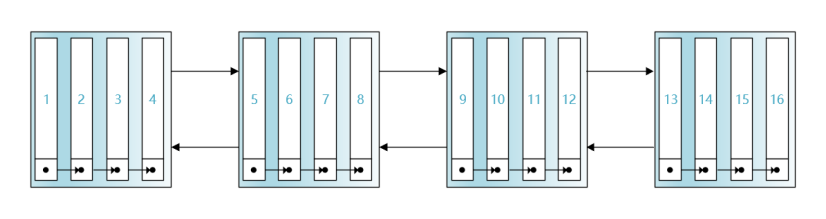
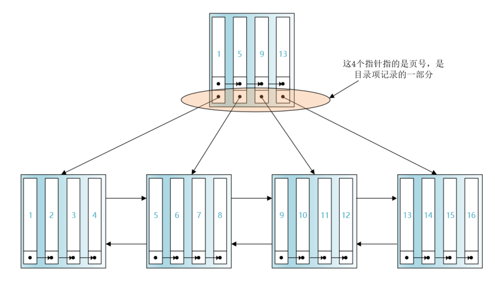
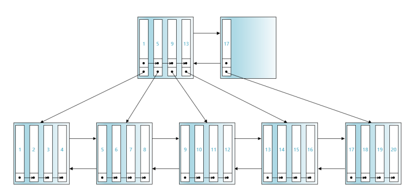
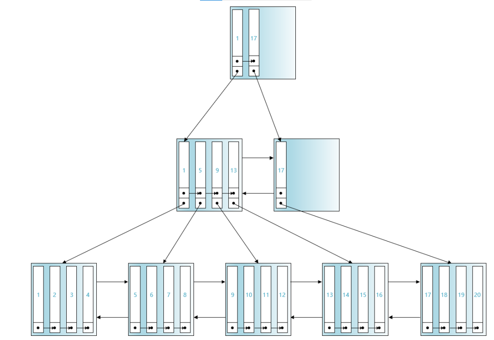
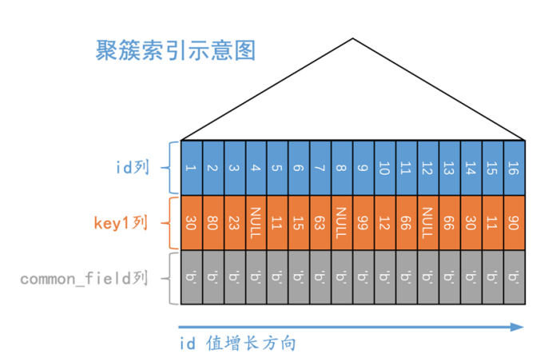
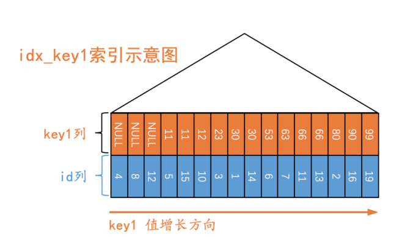

# MySQL索引

## 没有索引的查找

> 很多情况，表的记录是很多的，记录被存储在`多个数据页`中，我们不能直接定位记录所在的数据页，所以需要定位到第一个数据页，在数据页中的`记录单向链表`中使用页目录查找记录，然后再访问下一个数据页。
>
> `页面在磁盘上可能不相邻`



## 索引

> 为了快速定位记录所在的`数据页`，可以为数据页建立目录，但建立目录的要求是：
>
> 1. 下一个数据页中的记录主键值要大于上一个页面的主键值
> 2. 给所有的页建立`目录项`
>
> 目录项包括2个部分：
>
> - 页面中记录的最小主键值
> - 页面的页号


> 只要这些目录项在物理上连续存储，我们就可以利用键值快速定位某条记录，但是有一下2个问题：
>
> 1. InnoDB使用页作为管理存储空间的基本单位，也就是只能保证16K的连续存储空间
> 2. 我们会对记录进行增、删操作，如果页面中的记录都被删除，这个页面也就没有存在的必要，对应的`目录项`也要被删除，`目录项需要被移动`
>
> InnoDB使用了灵活的方式管理目录项，目录项与记录很像，InnoDB把这些目录项存放到页面中（就像将用户记录存放到数据页中）



> **目录项与用户记录比较**
>
> - 目录项记录、用户记录的头信息`record_type`分别为1、0
>
> - 目录项记录只有`主键值`、`页号`
>
> 除了上述的不同，它们之间没什么差别，有了目录项页面，根据主键值定位记录的步骤变为：
>
> 1. 在存储`目录项`的页面中使用二分法定位目录项记录，根据页号定位用户记录所在的页号
> 2. 根据主键值在数据页使用二分法定位用户记录



> 数据页的大小是有限的，当页面目录记录已经占满空间时，就需要创建一个新的数据页存储目录项记录，因为这些页面可能不是连续的，所以需要创建一个新的数据页来定位`存储目录项记录的页面`



> **聚簇索引与二级索引**
>
> 1. 页内记录是按照`索引列`大小顺序组成的单向链表，记录被划分为多个组，每组的`最大记录`在`页内的偏移量`被记录到`页目录`中，可以通过二分法定位记录
> 2. 存放`用户记录的页面`是根据用户记录的索引列大小顺序组成的双向链表
> 3. 存放`目录项记录`的`同一层级`页面是根据用户记录的索引列大小顺序组成的双向链表
>
> - 聚簇索引的B+树叶子节点存储的是完整的用户记录
> - 二级索引的B+树叶子节点存储的是索引列、主键值
>
> 
>
> **回表**
>
> 以非主键列大小为排序规则而建立的B+树需要执行回表操作才可以定位`完整的用户记录`


> **联合索引**
>
> 可以为多个列建立索引，记录的排序规则是先按照第一列进行排序，在第一列相同的情况下按照第二列进行排序，以此类推


## InnoDB的B+树索引特点

> **根页面不变化**
>
> 1. 当为某个表建立B+树索引时，都会为这个索引建立一个根节点页面，最开始时页面没有相关记录
> 2. 向表插入记录时，记录会存储到根页面节点
> 3. 根节点没有可以空间，继续插入用户记录时，此时根节点会将数据复制到一个新分配的页面，对新页继续页分裂，用户记录被分配到2个新页，根节点变成了存储`目录项记录`的页面，记录之前创建的2个页面的`目录项`
>
> 根页面自创建后，就不会改变位置（页号不变），页号会被记录到其他地方
>
> 
>
> **目录项记录的唯一性**
>
> 目录项记录的内容是由3部分组成的：
>
> 1. `索引列值`
> 2. `主键值`
> 3. 页号
>
> 这样就可以保证目录项记录的唯一性
>
> 
>
> **一个页面至少容纳2条记录**
>
> InnoDB为了避免B+树层级增长，要求所有数据页至少可以容纳2条记录


## MyISAM索引方案

> InnoDB中索引即数据，聚簇索引中的B+数据叶子节点存放了所有完整的用户记录，而MyISAM索引方案使用了树结构，但是是将`索引`、`数据`分开存储。
>
> **记录**
>
> MyISAM将表的记录按插入顺序单独存放到一个文件中（数据文件），这个文件不划分数据页，可以通过`行号`来定位一条记录。
>
> **索引**
>
> MyISAM存储引擎将索引信息单独放到另一个文件中（索引文件），索引的叶子节点存放的是`主键值`、`行号`，通过索引找到行号后，就可以根据行号定位记录。MyISAM建立的索引是`二级索引`。


# B+树索引的使用

## 表结构

```sql
create table single_table (
    id           int auto_increment primary key,
    key1         varchar(100) null,
    key2         int          null,
    key3         varchar(100) null,
    key_part1    varchar(100) null,
    key_part2    varchar(100) null,
    key_part3    varchar(100) null,
    common_field varchar(100) null,
    constraint uk_key2 unique (key2)
);

create index idx_key1 on single_table (key1);

create index idx_key3 on single_table (key3);

create index idx_part on single_table (key_part1, key_part2, key_part3);
```

> 创建表并插入数据后





> 通过索引可以定位到第一条key1列为某个值的第一条记录，然后沿着这条记录所在的单向链表进行扫描


## 索引的代价

> **空间代价**
>
> 每建立一个索引都需要为它建立一棵B+树，每一个节点都是一个数据页（占用16K）
>
> 
>
> **时间代价**
>
> 1. 索引的叶子节点、内节点的记录都是按照索引值来进行排序的，对表进行`增`、`删`、`改`操作，可能修改索引列的值，对排序进行了破坏，需要额外的时间开销来完成`页分裂`、`页回收`等操作，以维护`节点`、`节点内记录的顺序`，如果建立多个索引，就需要维护多个索引
> 2. 在执行查询前，需要生成`执行计划`，一般情况下，查询最多只涉及一个索引，在生成执行计划前，需要计算使用不同索引进行查询的成本，选择成本最低的一个索引来完成查询操作，计算使用索引的成本需要花费时间。


### 应用B+树索引

> B+树叶子节点的记录是按照索引值来进行排序的，使用索引可以减少需要扫描的记录数量


> 查询语句是要查询[500, 10000]的聚簇索引记录，可以用聚簇索引快速定位到id为500的记录，然后沿着记录所在的单向链表向后扫描，直到某条记录不在此区间内。
>
> 待扫描的id值的区间称为`扫描区间`，形成扫描区间的查询条件是形成扫描区间的`边界条件`

```sql
select *
from single_table
where id >= 500
  and id <= 10000;
```


> 只包含一个值的扫描区间被称为`单点扫描区间`，下面查询使用了key1列的索引，因为查询列表是*，所以使用索引进行查询后得到主键值，需要进行回表操作。

```sql
select *
from single_table
where key1 in (100, 1000);
```


> 不是所有的查询条件都能形成边界条件，如下面的查询，在使用key1列的索引情况下，进行回表操作得到完整的用户记录后，才能进行对条件`key3 > 50 and common_field = 'a'`的判断。

```sql
select *
from single_table
where key1 in (100, 1000)
  and key3 > 50
  and common_field = 'a';
```


> **形成扫描区间的情况**
>
> B+树`索引列`与`常数`与下面的操作符进行操作：
>
> 1.  `=`、`>`、`<`、`>=`、`<=`、`<=>`
> 2. `!=`
> 3. `in`、`not in`
> 4. `is null`、`is not null`
> 5. `like`，只有在`至少匹配字符串前缀`时才能产生扫描区间


> **And与Or**
>
> - 条件之间使用`and`，则最终的扫描区间是条件形成的扫描区间的交集
> - 条件之间使用`or`，则最终的扫描区间是条件形成的扫描区间的并集


### 使用联合索引形成扫描区间

> 下面的查询语句中，列key_part1相同的情况下，是按照key_part2列的值进行排序的，所以形成的扫描区间是[('a', 'b'), ('a', 'b')]。
>
> 将条件`key_part2 = 'b'`换成`key_part3 = 'b'`，则不能形成这个扫描区间，因为符合`key_part1 = 'a'`记录中是按照`key_part2`排序的，而不是`key_part3`。
>
> 将条件`key_part1 = 'a'`换成`key_part1 > 'a'`，则不能形成这个扫描区间，因为符合`key_part1 > 'a'`这些记录不是按照`key_part2`进行排序的
>
> 将条件`key_part1 = 'a'`换成`key_part1 >= 'a'`，符合`key_part1 = 'a'`的记录中是按照`key_part2`进行排序的，可以形成[('a', 'b'), (+∞, +∞)]扫描区间

```sql
select key_part1, key_part2
from single_table
where key_part1 = 'a'
  and key_part2 = 'b';
```


### 索引用于排序

> 索引是按照索引值进行排序的，所以`order by`子句使用了索引列，就可能省去`文件排序`步骤，在使用联合索引列进行排序时，需要保证该列之前的所有列是有序的，才可用该列进行排序
>
> MySQL 8引入了Descending Index，order by子句支持升序、降序混用
>
> order by子句后必须是单独的列名，而不可是修饰的形式（如对列名使用upper函数）


## 回表的代价

> 二级索引叶子节点存储的数据不是完整的用户记录，如果使用二级索引进行查询，可能需要进行回表操作，对于InnoDB存储引擎来说，索引的数据必须存放到磁盘中，等到需要时才加载到内存。
>
> B+树索引的节点是使用双向链表连接的，这些页面在物理上可以不相邻（InnoDB还是让同一个索引的叶子节点尽可能相邻）。
>
> 在进行回表操作时，如果相关的聚簇索引记录对应的页面不在内存中，就需要从磁盘中加载，而因为二级索引记录中的主键值是没有规律的，这会造成`随机IO`。如果需要回表的记录占用全部记录的绝大部分，`优化器`可能会使用`全表扫描`。


## 更好的创建与使用索引

### 创建索引

> **创建索引**
>
> 只为出现在`where`、`连接子句`、`order by`、`group by`的列创建索引。
>
> 
>
> **考虑索引不重复值的个数**
>
> 某个扫描区间的记录越多，回表的操作的成本就越大，如果`不重复度`太低，使用索引就可能执行太多次回表操作。
>
> 
>
> **索引列的数据类型尽可能小**
>
> 数据类型占用的存储空间越小，一个页面就可以存放更多的记录，磁盘IO带来的性能损耗就小。
>
> 
>
> **为列前缀建立索引**
>
> 可以只将字符串前的`几个字符`存放到索引中，减小索引占用的空间，不过这样的话，对完整列进行排序就不可利用索引。
>
> 
>
> **主键的选择**
>
> 用户记录是存储在聚簇索引中，按照主键值进行排序的，如果插入记录的主键值不是递增的，在插入记录时可能需要进行`页分裂操作`，带来性能损耗。
>
> 
>
> **注意冗余索引**
>
> 不要创建多余的索引


### 使用索引查询

> **覆盖索引**
>
> 为了彻底告别回表带来的性能损耗，查询列表最好只包含索引列，不要使用*作为查询列表。
>
> 
>
> **查询使用索引**
>
> 让索引列以列名的形式出现在查询条件中，而不要对索引列使用相关操作（如使用函数）。

